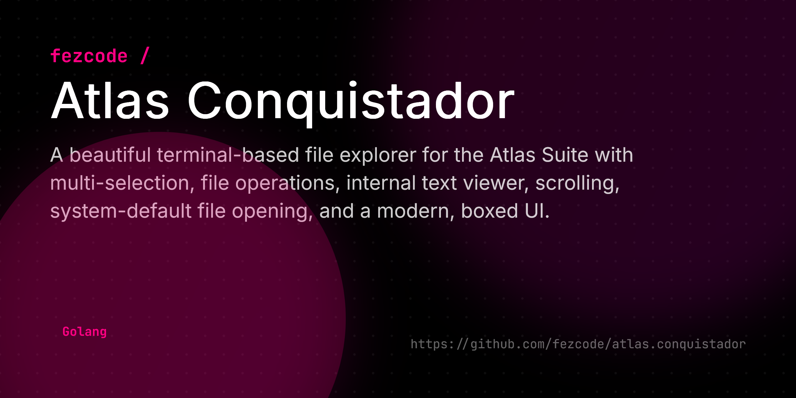

# atlas.explorer



A beautiful and functional terminal-based file explorer like Finder or Windows Explorer.

## Features

- **Beautiful UI**: Built with Bubble Tea and Lip Gloss for a modern terminal experience.
- **Navigation**: Intuitive `j/k` or arrow key navigation.
- **Multi-selection**: Select multiple files/directories using `space`.
- **Operations**: 
  - **Copy/Cut/Paste**: Standard `c`, `x`, `p` shortcuts.
  - **Delete**: Quick `d` shortcut for removal.
- **Sorting**: Toggle between Name, Size, and Time using `s`.
- **Open**: Enter directories or open files (using system defaults).

## Installation

```bash
# Using gobake
gobake build
./build/atlas.explorer
```

## Usage

| Key | Action |
|-----|--------|
| `j`/`k` | Move cursor up/down |
| `enter` | Enter directory / Open file |
| `backspace` | Go to parent directory |
| `space` | Toggle selection |
| `c` | Copy selected items to clipboard |
| `x` | Cut selected items to clipboard |
| `p` | Paste items from clipboard |
| `d` | Delete selected items |
| `s` | Cycle sort order (Name -> Size -> Time) |
| `q` | Quit |

## License

MIT
